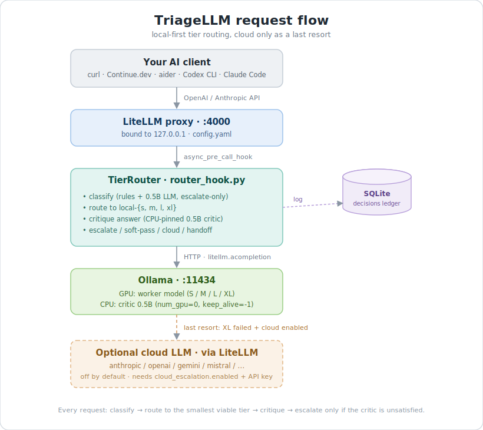

# TriageLLM

> *Smart tier routing for local Ollama models, so you stop paying cloud-API
> rates on the easy stuff.*

[](https://github.com/nishiithtrivedi-a11y/TriageLLM/actions/workflows/ci.yml)
[](https://github.com/nishiithtrivedi-a11y/TriageLLM/releases)
[](LICENSE)
[](https://www.python.org/)
[](https://github.com/BerriAI/litellm)
[](https://github.com/ollama/ollama)

**TriageLLM** is a local-only tier-routing proxy in front of [Ollama](https://ollama.com/). It picks
the right-sized model for each request, critiques the answer, and escalates to a
bigger model (or optionally a cloud API) only when needed.

**Goal:** cheap, fast, private coding assistance — pay cloud-API rates only for
problems your laptop genuinely can't solve.



> **Client note:** Anthropic-API agents (Claude Code, Anthropic SDK apps) need a small
> env-var redirect -- see "Using it from clients" below. OpenAI-API agents (aider, Codex
> CLI variants, anything reading `OPENAI_API_BASE`) work out of the box.

📚 **Want more detail?** See [docs/JOURNEY.md](docs/JOURNEY.md) for the build
notes (including the eviction-cascade problem and the CPU-critic fix). For
architecture deep-dives, see [docs/ARCHITECTURE.md](docs/ARCHITECTURE.md).
For common questions, see [docs/FAQ.md](docs/FAQ.md).
Jump to: [What TriageLLM is NOT](#what-triagellm-is-not) · [Client compatibility](#client-compatibility) · [Ledger schema reference](docs/ARCHITECTURE.md#ledger-schema-reference) · [Troubleshooting](docs/FAQ.md#troubleshooting).

## What TriageLLM is NOT

Honest expectation-setting -- TriageLLM has narrow ambitions on purpose. Here's
what it explicitly is not, and what to use instead:

- **Not a frontier-model replacement.** Local 1.5B--35B models cannot match
  Claude / GPT-5 / Gemini on frontier reasoning, long agentic loops, vision, or
  complex structured output. Use cloud frontier models for those; use TriageLLM
  to stop burning tokens on the routine work in between.
- **Not a multi-user / enterprise tool.** The proxy binds to `127.0.0.1` only
  (M-6 SSRF posture); there's no auth, no rate limiting, no per-user accounting.
  For shared serving, run a per-user instance or pair raw LiteLLM Proxy with your
  auth stack.
- **Not a managed service / Kubernetes thing.** Single-process, single-machine.
  For clustered inference, look at vLLM, Ray Serve, or a hosted inference
  provider.
- **Not a vector store / RAG framework.** No embeddings, no document index, no
  retrieval. Pair TriageLLM with LlamaIndex / LangChain RAG / your retrieval
  tool of choice -- TriageLLM becomes the inference endpoint underneath.
- **Not an agent framework.** No tool-calling orchestration, no agent loops.
  Use CrewAI / LangGraph / Anthropic SDK as the orchestrator with TriageLLM
  as the model endpoint.
- **Not a fine-tuning platform.** Routes between off-the-shelf Ollama models;
  doesn't train them. For fine-tuning use Axolotl / Unsloth / Hugging Face
  Trainer, then `ollama pull` or build a Modelfile from your trained
  checkpoint.

---

## Client compatibility

What's actually been validated, and what hasn't. "Not tested" is a first-class
status here — fake "validated" rows would be worse than honest gaps.

| Client | Status | Notes |
|---|---|---|
| OpenAI Python SDK | ✓ Validated | All examples in the [Quick start](#quick-start-everyday-use) work. |
| `curl` | ✓ Validated | The raw HTTP/JSON path `curl` speaks is exercised by `tests/run_evidence.py` (via `urllib`); see the [client setup](docs/FAQ.md#q-what-does-my-client-need-to-do-to-use-triagellm) FAQ. |
| aider | ✓ Validated | End-to-end through DEF-004; see [the aider entry](docs/FAQ.md#q-will-it-work-with-aider). |
| Continue.dev | ✓ Validated | Config in README + protocol smoke; see [the Continue.dev entry](docs/FAQ.md#q-will-it-work-with-continuedev). |
| Claude Code (Anthropic-API) | ⚠ Partial | Needs `ANTHROPIC_BASE_URL` + a model alias in `config.yaml` matching the requested name (e.g. `claude-sonnet-4-6`); see [Anthropic-API agents](docs/FAQ.md#q-will-it-work-with-cloud-ai-agents-like-claude-code-codex-cli-chatgpt-desktop). |
| Cursor / Cline / Roo Code | ⚠ Not tested | Cursor is SaaS-locked (can't redirect). Cline / Roo Code speak the same OpenAI protocol as Continue.dev, so they should work — but unvalidated. |

Desktop apps (ChatGPT desktop, Claude desktop) are **not redirectable** — see
[the desktop-app entry](docs/FAQ.md#q-will-it-work-with-chatgpt--claude-desktop-apps-directly).

---

## Benchmarks

Measured on **Ryzen 7 260 + RTX 5070 (12 GB VRAM) + 32 GB DDR5 RAM**:

| Operation | Median | p95 | Notes |
|---|---|---|---|
| Critic call (CPU-pinned, default) | **0.58 s** | 0.63 s | Eviction-immune |
| Critic call (GPU-pinned, alternative) | 0.58 s | 0.58 s | Equivalent speed, but evictable |
| Tier S query (1.5B model, warm) | ~3-4 s | — | Routine work |
| Tier M query (16B model, warm) | ~5-10 s | — | Real coding |
| Critic warmup at proxy startup | ~2.7 s (one-time) | — | Pre-loaded before first user request |

**Key finding:** at 0.5B critic size, CPU placement matches GPU latency
*identically* but gives total eviction immunity on low-VRAM machines. Run
`benchmark.py` to measure on your hardware.

### Per-machine model benchmark (`benchmark.py --tasks`)

Benchmarks each installed Ollama model against curated prompts per capability
category and writes a per-(model, category) recommendation map to
`benchmark_results.json`.

```powershell
# Full run (5 prompts/category); writes benchmark_results.json
.\.venv\Scripts\python.exe benchmark.py --tasks

# Quick sanity run (2 prompts/category)
.\.venv\Scripts\python.exe benchmark.py --tasks --quick

# Scope to specific models
.\.venv\Scripts\python.exe benchmark.py --tasks --models qwen3-coder:30b,deepseek-coder-v2:16b
```

Sample report:

```
TriageLLM task benchmark (mode=full, P=5)
============================================================
Models: qwen3-coder:30b, deepseek-coder-v2:16b
Recommended model per category:
  quick_question           -> deepseek-coder-v2:16b   (success 1.00, p50 3.2s, by latency)
  structured_output        -> qwen3-coder:30b         (success 0.80, p50 6.2s, by success_rate)
  ...
```

The recommendation map is the per-machine evidence that future advisory mode
reads (priors). Tie-break: capability (success rate) first, then latency, then
model size.

### Capability advisory (`advisory.py`)

After running the benchmark, see which per-(category, model) recommendations have
enough evidence to trust, and endorse them:

```powershell
# Advisory report (graduation status per category)
.\.venv\Scripts\python.exe advisory.py

# Endorse a graduated recommendation (writes advisory_endorsements.json)
.\.venv\Scripts\python.exe advisory.py --sign-off structured_output
.\.venv\Scripts\python.exe advisory.py --sign-off-all
```

Hard categories (JSON / code-edit) graduate on the benchmark alone; soft categories
need a strong benchmark score or live-ledger corroboration. Advisory only -- it
changes no routing; the endorsed map is the human-approved gate a future active-
routing phase will consume.

### Advisory backtest (`backtest.py`)

Validates your signed-off endorsements (`advisory_endorsements.json`) against
live ledger history, flagging endorsements that have drifted below what the
benchmark/critic promised at sign-off.

```powershell
.\.venv\Scripts\python.exe backtest.py            # all-time
.\.venv\Scripts\python.exe backtest.py --since 7d # last 7 days of decisions
.\.venv\Scripts\python.exe backtest.py --json
```

Per endorsed category it reports `upheld` / `drifted` / `contradicted` /
`insufficient-data` (drift vs the frozen sign-off snapshot). Read-only -- it never
changes your endorsements; act on a drift by re-running `benchmark.py --tasks` +
`advisory.py`.

For optimization on different hardware (8 GB / 24 GB / Apple Silicon), see
[docs/FAQ.md](docs/FAQ.md#hardware--optimization).

## Quick start (everyday use)

The `.bat` files in this folder are your control panel. **Right-click each
one → Send to → Desktop (create shortcut)** for one-click access.

| Shortcut | What it does |
|---|---|
| **`start_route_llm.bat`** | Starts Ollama (if not already running) + the proxy. Waits until everything is healthy, then prints the cheat-sheet. |
| **`local_mode.bat`** | Per-project local routing: pick a remembered folder and open a terminal where every AI CLI tool routes to local Ollama. Auto-starts the stack if needed. See [Local Mode](#local-mode-per-project-one-click). |
| **`dashboard.bat`** | Shows the usage report (tier distribution, escalation rate, tokens, recent activity). Safe to run anytime; doesn't touch the proxy. |
| **`health.bat`** | Probes proxy + Ollama + every model + the critic. Prints PASS/WARN/FAIL for each. (~10 s) |
| **`doctor.bat`** | Setup pre-flight: checks config, installed models, cloud-audit, and routing mode. Runs offline (no proxy needed). First thing to reach for when something's off. |
| **`uat.bat`** | Full end-to-end User Acceptance Test against the live proxy — liveness, classifier accuracy, real round-trip, streaming. Run before releases. Requires the proxy to be running. (~2-3 min) |
| **`stop_route_llm.bat`** | Stops the proxy. Leaves Ollama running. |

`dashboard.bat` accepts the same flags as `stats.py`:

```
dashboard.bat --last 50
dashboard.bat --since "2 days"
dashboard.bat --json
dashboard.bat --capability   # Capability Routing v0.2 shadow-data view (opt-in)
```

**New in #17 -- observability:**

```powershell
# Drill into one decision (latest by default; or paste a ts from --json)
.\.venv\Scripts\python.exe stats.py --explain
.\.venv\Scripts\python.exe stats.py --explain 1700000000.123

# Override the failure threshold for the most-failing-model report (default 4)
.\.venv\Scripts\python.exe stats.py --pass-threshold 3
```

The default `stats.py` report now includes **per-model latency P50/P95/P99**
(no more mean-hides-tail) and a **most-failing-models** section (which model is
the weak link?). Both also appear in `--json` output.

When everything is up, the proxy is at **`http://localhost:4000`**, the API key is
**`sk-local-dev`**, and you ask for the model **`local-auto`**.

---

## What it actually does

When a client calls the proxy with `model: "local-auto"`:

1. **Classify** the prompt into S / M / L / XL using rule-based heuristics, plus
   an optional 0.5B LLM classifier for longer prompts.
2. **Route** the request to the matching Ollama model.
3. **Critique** the response with a small LLM. If the score is below threshold,
   escalate to the next tier and retry. Walks all the way to XL.
4. **Cloud step (optional, off by default).** If XL still fails and
   `cloud_escalation` is configured + the API key env var is set, call the cloud
   model once before giving up.
5. **Handoff.** If everything fails, the response body is replaced with a clear
   ledger showing every attempt and the best local draft.

Every decision is logged to `router_decisions.sqlite`. Run `dashboard.bat` to read it.

**Capability Routing v0.2 (shadow mode, opt-in).** An experimental sidecar classifies each request into one of 10 universal intent categories (e.g. `quick_question`, `structured_output`, `high_risk`) and records the tier it *would* have chosen alongside the standard routing decision — without changing actual routing. Disabled by default; set `TRIAGELLM_CAPABILITY_ROUTING_ENABLED=1` to enable.

**Advisory mode (opt-in, observe-only).** Set `TRIAGELLM_CAPABILITY_MODE=advisory`
to surface the capability classifier's per-request recommendation without changing
any routing. Each request logs a line like
`[advisory] cap=structured_output suggested=M actual=S agree=no conf=0.60`, and
non-streaming responses carry `x-triagellm-cap-*` headers (verified reaching the
client on litellm 1.84.0; treated as best-effort since header delivery is
litellm-version-dependent -- the log line and the SQLite ledger are the guaranteed
record). `advisory` implies the classifier is enabled, so this single env var turns
it on. Defaults remain off (`shadow`).

### Tiers

| Tier | Alias | Model (Ollama tag) | Intended use |
|------|-------|--------------------|--------------|
| S    | `local-s`       | `qwen2.5-coder:1.5b`   | autocomplete, rename, syntax Qs, one-liners |
| M    | `local-m`       | `deepseek-coder-v2:16b`| implement a function, write a test, small bugs |
| L    | `local-l`       | `qwen3-coder:30b`      | multi-file refactor, debug a stack trace, perf work |
| XL   | `local-xl`      | `qwen3.6:35b`*         | architecture, security, concurrency, migrations |
| —    | `local-general` | `gemma4:26b`*          | docs and explanations (optional) |
| —    | `local-auto`    | (chosen by router)     | the virtual model — clients send this |

*`qwen3.6:35b` and `gemma4:26b` are custom Modelfile builds, not public registry tags.

---

## Using it from clients

The proxy speaks the **OpenAI Chat Completions API** at `/v1/chat/completions`
and the **Anthropic Messages API** at `/v1/messages`. So almost any AI tool with a
configurable base URL can talk to it.

### Easiest: Continue.dev (VS Code extension)

Install the [Continue](https://marketplace.visualstudio.com/items?itemName=Continue.continue)
extension, then edit `~/.continue/config.json`:

```json
{
  "models": [
    {
      "title": "Route LLM (auto)",
      "provider": "openai",
      "model": "local-auto",
      "apiBase": "http://localhost:4000/v1",
      "apiKey": "sk-local-dev"
    }
  ]
}
```

Restart VS Code. Continue now uses Route LLM for chat and autocomplete — fully free
unless the local stack hands off.

### aider (CLI coding agent)

```powershell
$env:OPENAI_API_BASE = "http://localhost:4000/v1"
$env:OPENAI_API_KEY  = "sk-local-dev"
aider --model openai/local-auto
```

### Plain `curl` / scripts

```bash
curl http://localhost:4000/v1/chat/completions \
  -H "Authorization: Bearer sk-local-dev" \
  -H "Content-Type: application/json" \
  -d '{
    "model": "local-auto",
    "messages": [{"role": "user", "content": "refactor this module"}]
  }'
```

### Anthropic-API agents (Claude Code, Anthropic SDK apps, etc.) — with caveats

Tools that speak Anthropic's API (rather than OpenAI's) — e.g. Anthropic's
own Claude Code CLI, Anthropic SDK apps, or any third-party agent built
against `api.anthropic.com` — always ask for an Anthropic-style model name
like `claude-sonnet-4-6`. To redirect them at the proxy you need two things:

**1. Add a model alias in `config.yaml`** so the proxy knows what to do when
the client asks for an Anthropic model name:

```yaml
model_list:
  # ... existing local-s, local-m, local-l, local-xl entries ...

  # The client will ask for this name; we serve qwen3-coder under the hood:
  - model_name: claude-sonnet-4-6
    litellm_params:
      model: ollama_chat/qwen3-coder:30b
      api_base: http://localhost:11434
```

Restart the proxy.

**2. Set environment variables before launching the client**:

```powershell
$env:ANTHROPIC_BASE_URL   = "http://localhost:4000"
$env:ANTHROPIC_AUTH_TOKEN = "sk-local-dev"
# then launch the client (e.g. `claude`, or whatever Anthropic-SDK app you use)
```

Now the client will send requests to your proxy thinking it's Anthropic's cloud.

**Important caveats:**
- This only works for plain-text chat. Cloud-agent feature sets (tool use,
  MCP connectors, vision, structured outputs, agentic loops) need real cloud
  frontier models. Local models can't replicate those. Expect downgraded
  behavior on anything beyond chat.
- If a local-served prompt fails the critic and triggers handoff, the
  client will *not* know to retry against the real cloud API — it'll just
  receive the handoff message as a normal assistant response.
- For most "I want a local coding assistant" use cases, **Continue.dev or
  aider give a smoother experience** than redirecting an Anthropic-API agent.

The honest recommendation: **keep using cloud agents (Claude Code, Codex CLI,
ChatGPT, etc.) on their native clouds for the work that genuinely needs
frontier-model features. Use Continue.dev or aider against TriageLLM for
the routine code edits that don't.** That's the actual cost-saving pattern.

### Codex CLI / OpenAI-API agents

OpenAI-API tools (Codex CLI variants, aider, anything that respects
`OPENAI_API_BASE`) work out of the box — just point them at
`http://localhost:4000/v1` with API key `sk-local-dev` and the model
`local-auto`. See the aider example above for the exact env vars.

---

## Local Mode (per-project, one click)

Want a specific project to use your free local models while every other
project keeps using your normal cloud AI — without editing any config? Use
**Local Mode**.

1. Double-click **`local_mode.bat`** (right-click → Send to → Desktop to make a shortcut).
2. Press **[A]** and pick your project folder (it's remembered for next time).
3. Pick the folder's number. A new terminal opens, scoped to that folder, where
   every AI CLI tool routes through TriageLLM to local Ollama. The proxy
   auto-starts if it isn't already running.
4. Work as usual:
   - Claude Code: just run `claude`
   - Codex CLI: `codex --model local-auto`
   - aider: `aider --model openai/local-auto`
5. **Close that window** to go back to normal cloud AI. Nothing permanent
   changes — the redirect lives only inside that window.

**How it works:** the launcher opens a terminal with the standard redirect
environment variables (`OPENAI_BASE_URL`, `ANTHROPIC_BASE_URL`, etc.) pre-set.
Any tool launched from that window inherits them and talks to the proxy. Close
the window and the variables vanish.

**Notes & limits:**
- Works with any CLI tool that respects standard env vars (Claude Code, Codex
  CLI, aider, custom OpenAI/Anthropic SDK scripts).
- Does **not** work with Claude Desktop / ChatGPT Desktop — those can't be
  redirected (they ignore env vars and base-URL settings).
- **Anthropic tools auto-route**; **OpenAI tools** need `--model local-auto`
  passed explicitly (there's no universal `OPENAI_MODEL` env var). The window's
  banner reminds you.
- The proxy stays warm after you close a window. Use `stop_route_llm.bat` for a
  full shutdown.
- Your remembered folders live in `local_projects.json` (gitignored — personal
  to your machine).

---

## Manual start / stop (if you ever need to do it by hand)

The `.bat` files do these steps for you, but here's what they're doing:

**Start:**
1. Ollama: launch from Start Menu (or `& "$env:LOCALAPPDATA\Programs\Ollama\ollama app.exe"`).
2. Proxy: `cd path\to\TriageLLM; .\start_proxy.ps1`

If PowerShell refuses to run the script ("execution policy"), use:
```powershell
powershell.exe -ExecutionPolicy Bypass -NoProfile -File .\start_proxy.ps1
```

**Stop:**
- Proxy: press Ctrl+C in its window, or close the window.
- Ollama: right-click the llama icon in the system tray → Quit.

**Check health:**
```powershell
curl http://localhost:4000/health/liveliness
```

---

## First-time setup on a fresh machine

You only need to do this once. After that, the `.bat` files handle everything.

```powershell
# 1. Install Python 3.12 (litellm doesn't support 3.14)
winget install --id Python.Python.3.12

# 2. Install Ollama from https://ollama.com (or via winget)
winget install --id Ollama.Ollama

# 3. Tell Ollama where your model store is (only if not in the default location)
[Environment]::SetEnvironmentVariable('OLLAMA_MODELS', 'D:\Ollama\Models', 'User')
# Restart Ollama after this — the daemon only reads the env var at startup.

# 4. Clone this repo
git clone https://github.com/nishiithtrivedi-a11y/TriageLLM.git
cd TriageLLM

# 5. Create the venv and install dependencies
py -3.12 -m venv .venv
.\.venv\Scripts\python.exe -m pip install -r requirements.txt

# 6. Pull whichever models you'll actually use
ollama pull qwen2.5:0.5b           # classifier + critic (small, always needed)
ollama pull qwen2.5-coder:1.5b     # tier S
ollama pull deepseek-coder-v2:16b  # tier M
ollama pull qwen3-coder:30b        # tier L
# Tier XL (qwen3.6:35b) and general (gemma4:26b) are custom Modelfile builds,
# not pullable from the registry. Either build them yourself or edit config.yaml
# to point to a public XL model like qwen2.5:32b.

# 7. (Optional) Generate a config from your installed models instead of hand-
#    editing config.yaml. init.py detects your Ollama models via /api/tags and
#    assigns them to the S/M/L/XL tiers by size.
.\.venv\Scripts\python.exe init.py            # writes config.generated.yaml
#    Review it, then either apply it (backs up your existing config.yaml):
.\.venv\Scripts\python.exe init.py --write    # writes config.yaml + config.yaml.bak

# 8. Run the tests to make sure everything's wired up.
#    The env var is REQUIRED — without it, importing router_hook fires a real
#    Ollama call at module load and pytest hangs.
$env:TRIAGELLM_SKIP_WARMUP = "1"
.\.venv\Scripts\python.exe -m pytest -q

# 9. Start it
.\start_route_llm.bat
```

---

## Tuning

All knobs are in the `route_llm:` block of [config.yaml](config.yaml):

| Setting | Purpose |
|---|---|
| `use_llm_classifier` | Disable to use rules only |
| `llm_classifier_min_chars` | Below this prompt length, skip the LLM classifier |
| `llm_classifier_timeout_s` | Hard timeout on the classifier call |
| `classifier_model` | Ollama tag used for tier classification |
| `critic_model` | Ollama tag used for response scoring |
| `critic_timeout_s` | Hard timeout on the critic call |
| `critic_pass_threshold` | Critic score below this triggers escalation |
| `cloud_escalation.enabled` | After XL fails, try a cloud model before giving up |
| `cloud_escalation.model` | LiteLLM tag, e.g. `anthropic/claude-sonnet-4-6` |
| `cloud_escalation.api_key_env` | Name of the env var holding the API key |
| `cloud_escalation.timeout_s` | Hard timeout on the cloud call |

API keys go in **env vars referenced by name** (`api_key_env: ANTHROPIC_API_KEY`),
never raw values in YAML.

---

## Streaming

Streaming responses pass through chunk-by-chunk unchanged. After the upstream
stream ends, the critic runs on the assembled text. If the score is below
threshold, one additional chunk is appended containing the handoff note. No
mid-stream re-routing.

### Setup doctor (`doctor.py`)

Checks your *setup* (vs `health.py`, which checks the running stack). Runs
without the proxy, so it's the first thing to reach for when something's off.

```powershell
.\.venv\Scripts\python.exe doctor.py             # all checks
.\.venv\Scripts\python.exe doctor.py --cloud-audit  # local-first proof
.\.venv\Scripts\python.exe doctor.py --mode         # routing x cloud status
.\.venv\Scripts\python.exe doctor.py --skip-models  # fully offline
```

Checks: Ollama reachable, every configured model is installed (with an
`ollama pull` fix if missing), config coherence, a ledger-evidence cloud audit
("0 cloud attempts in your last 1000 requests"), and the routing x cloud mode.
`doctor.bat` is the double-click launcher.

## Tests

Two layers of testing — fast-and-mocked vs live-and-real:

**Fast unit suite (mocked, no Ollama needed) — run on every edit:**

```powershell
$env:TRIAGELLM_SKIP_WARMUP = "1"
.\.venv\Scripts\python.exe -m pytest -q
```

442 tests covering: rule classifier, mocked LLM classifier + critic, config
loading, multi-step escalation, cloud step, handoff rendering, stream wrap,
SQLite migration, dashboard aggregations, CPU-pin behavior, tier-aware
soft-pass, the 5 critical-bug regressions from the multi-agent audit
(`tests/test_critical_fixes.py`), the High/Medium hardening fixes
(`tests/test_backlog_fixes.py` -- loop cap, log fallback, typed failure
logging, key redaction, streaming/non-streaming convergence), the fast-fail
circuit breaker (`tests/test_fast_fail.py`), Capability Routing v0.2
(`tests/test_capability.py`, `tests/test_capability_ledger.py`), the
per-machine task benchmark (`tests/test_task_benchmark.py`), the
capability advisory CLI (`tests/test_advisory.py`), the advisory
backtest (`tests/test_backtest.py`), the setup doctor
(`tests/test_doctor.py`), runtime failure-message detection
(`tests/test_failure_messages.py`), and stats observability
(`tests/test_stats_observability.py`). Finishes in ~5 seconds.

**Live end-to-end UAT (real proxy + real Ollama) — run before releases:**

```powershell
# Start the proxy first (in another window):
.\start_route_llm.bat

# Then in a new window:
.\uat.bat
```

Four phases: liveness probe, classifier accuracy on 4 curated prompts,
real round-trip through `/v1/chat/completions` with ledger inspection,
streaming chunks + post-stream critic. Takes ~2-3 minutes. See `uat.py`
for what each phase asserts.

## Troubleshooting

| Symptom | Cause / fix |
|---|---|
| Proxy window flashes red and exits | Run `pytest` to see what's broken. Most common: a recent edit to `router_hook.py` has a Python error. |
| `curl :4000/...` → connection refused | Proxy isn't running. Start it with `start_route_llm.bat`. |
| Every request returns "model not found" | Ollama can't see your models. Run `ollama list` — if empty, set `OLLAMA_MODELS` and restart Ollama. |
| Client says "401 unauthorized" | Wrong API key. It's `sk-local-dev` (or whatever you set in `config.yaml` under `master_key`). |
| First request is very slow (30–60s) | Normal cold-load. Models stay warm after first use thanks to `keep_alive: 30m`. |
| Dashboard shows giant `duration_s` numbers | An old version had a test fixture that polluted the prod DB. Pull latest and the fix is automatic. |
| Pytest hangs forever | Set `$env:TRIAGELLM_SKIP_WARMUP = "1"` before running — without it, importing `router_hook` fires a real Ollama call at module load. The env var is set automatically in `uat.bat` and `health.bat`. |

---

## About the author & feedback

This project was built by **Nishith Trivedi** — an SAP Supply Chain analyst
who likes building things with AI on the side. I'm not a professional
developer; this was vibe-coded with substantial help from AI coding
assistants. The discoveries documented here are real, but the design will
absolutely have weak spots a real ML/infra engineer would catch
immediately. If that's you, **please file an issue or pull request** — I'd
much rather learn than ship something subtly wrong.

If TriageLLM saves you time or cloud-API money, a shout-out on
[LinkedIn](https://www.linkedin.com/in/nishith-t-5220a5b4) would genuinely
make my day. And if you'd like to collaborate on this or anything adjacent
— routing, local LLM infra, AI-assisted developer tools — I'm reachable
there too.
